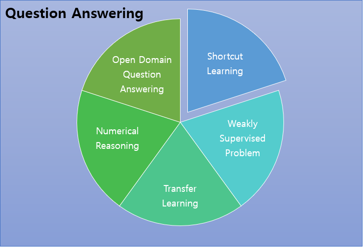

# Yonsei NLP Study Season 3
  
**[About Yonsei NLP Study]**  
Yonsei NLP Study is consisted of 4 Students who are very passionate in the field of Natural Language Processing!  
Every week, each student read papers regarding a certain subject.  
Then, each student gets to present about the topic he prepared for.  
After the presentation, all the students discuss about that paper and share ideas.  
 
**[About Season 3]**  
Yonsei NLP Study Season 2 (2022.01.01 ~ 2022.03.01)  
Main Topic : Question Answering  
Among the 4 members, Seungone Kim and Sejune Joo participated in this topic!  
 
**[About this repository]**  
This repository contains presentation materials, links to presentation videos, and a summary of all the papers we have studied in Yonsei NLP Study Season2(2021.09.08~2021.11.17). Our Main Topic was Question Answering and the various techniques needed to solve QA. We have covered 55 papers in total!  
 
## About the Members
* [Seungone Kim(김승원)](https://github.com/SeungoneKim) - Leader!
* [Sejune Joo(주세준)](https://github.com/joocjun)

## Link to Presentation(Youtube)
* [Shortcut Learning in QA (Part1) (Seungone Kim)](https://www.youtube.com/watch?v=8KXEvSDXUBI)
* [Shortcut Learning in QA (Part2) (Seungone Kim)](https://www.youtube.com/watch?v=aFc-WwjpEyk&t=630s)
* [Weakly Supervised Problem in QA (Part1) (Seungone Kim)](https://www.youtube.com/watch?v=nrYN8bW-mpg&t=347s)
* [Weakly Supervised Problem in QA (Part2) (Seungone Kim)](https://www.youtube.com/watch?v=L73oj2TIa0A)
* [Transfer Learning in QA (Seungone Kim)](https://www.youtube.com/watch?v=dj8NXES7Rx0&t=1379s)
* [Numerical Reasoning in QA (Part1) (Seungone Kim)](https://www.youtube.com/watch?v=y8oXJqjU8pw)
* [Numerical Reasoning in QA (Part2) (Seungone Kim)](https://www.youtube.com/watch?v=2AtHxIJ0lV8)
* [Open Domain Question Answering (Part1) (Seungone Kim)](https://www.youtube.com/watch?v=5djNj2-rK30&t=1287s)
* [Open Domain Question Answering (Part2) (Seungone Kim)](https://www.youtube.com/watch?v=JtMt-LsZhXU&t=1285s)
* [Open Domain Question Answering (Part3) (Seungone Kim)](https://www.youtube.com/watch?v=MvUQiX1L0OI)

## List of Papers we covered
The following are the list of 19 papers  

### TALK 1 : Shortcut Learning in QA (Seungone Kim)
* [Avoiding reasoning shortcuts : Adversarial evaluation, training, and model development for multi-hop QA](https://aclanthology.org/P19-1262.pdf)
* [Why Machine Reading Comprehension Models Learn Shortcuts?](https://aclanthology.org/2021.findings-acl.85.pdf)
* [Robustifying multi-hop QA through pseudo-evidentiality training](https://aclanthology.org/2021.acl-long.476.pdf)

### TALK 2 : Weakly Supervised Problem in QA (Seungone Kim)
* [A Discrete Hard EM Approach for Weakly Supervised Question Answering](https://aclanthology.org/D19-1284.pdf)
* [ReasonBERT : Pre-trained to Reason with Distant Supervision](https://aclanthology.org/2021.emnlp-main.494.pdf)

### TALK 3 : Transfer Learning in QA (Seungone Kim)
* [UNIFIEDQA : Cross Format Boundaries with a Single QA System](https://aclanthology.org/2020.findings-emnlp.171.pdf)

### TALK 4 : Numerical Reasoning in QA (Seungone Kim)
* [Giving BERT a Calculator : Finding Operations and Arguments with Reading Comprehension](https://aclanthology.org/D19-1609.pdf)
* [NumNet : Machine Reading Comprehension with Numerical Reasoning](https://aclanthology.org/D19-1251.pdf)
* [Injecting Numerical Reasoning Skills into Language Models](https://aclanthology.org/2020.acl-main.89.pdf)
* [A Multi-Type Multi-Span Network for Reading Comprehension that Requires Discrete Reasoning](https://aclanthology.org/D19-1170.pdf)
* [Neural Symbolic Reader : Scalable Integration of Distributed and Symbolic Representations for Reading Comprehension](https://openreview.net/pdf?id=ryxjnREFwH)

### TALK 5 : Open Domain Question Answering (Seungone Kim)
* [Multi-step retriever-reader interaction for scalable open-domain question answering](https://openreview.net/pdf?id=HkfPSh05K7)
* [Multi-hop Paragraph Retrieval for Open-Domain Question Answering](https://aclanthology.org/P19-1222.pdf)
* [Learning to Retrieve Reasoning Paths over Wikipedia Graph for Question Answering](https://openreview.net/pdf?id=SJgVHkrYDH)
* [Answering Complex Open-Domain Questions with Multi-Hop Dense Retrieval](https://openreview.net/pdf?id=EMHoBG0avc1)
* [Adaptive Information Seeking for Open-Domain Question Answering](https://aclanthology.org/2021.emnlp-main.293.pdf)
* [Answering Open-Domain Questions of Varying Reasoning Steps from Text](https://aclanthology.org/2021.emnlp-main.292.pdf)
* [HopRetriever : Retrieve hops over Wikipedia to Answer Complex Questions](https://www.aaai.org/AAAI21Papers/AAAI-6577.ShaoboL.pdf)
* [Leveraging Passage Retrieval with Generative Models for Open Domain Question Answering](https://arxiv.org/abs/2007.01282)
